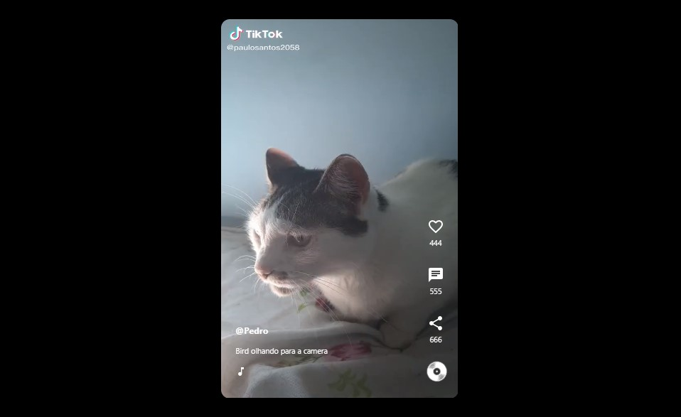

# Projeto "TikTok Clone" da Jornada Dev EBAC



## ✨ Sobre o Projeto

Durante a Jornada FullStack da [EBAC - Escola Britânica de Artes Criativas e Tecnologia](https://ebaconline.com.br/). mergulhamos no mundo da programação e desenvolvemos uma aplicação completa com HTML, CSS, Javascript e integração com banco de dados.

Este projeto foi iniciado com [Create React App](https://github.com/facebook/create-react-app).

## 💻 Tecnologias Utilizadas:


## ☕ Como utilizar o projeto:

1° Clone o repositório
```
git clone url
```
2° Inicialize o projeto no terminal
```
npm start
```
3° Ou acesse o deploy do projeto [Clicando aqui](https://tiktok---jornada-2d662.web.app/).